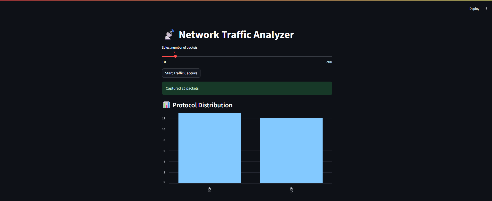
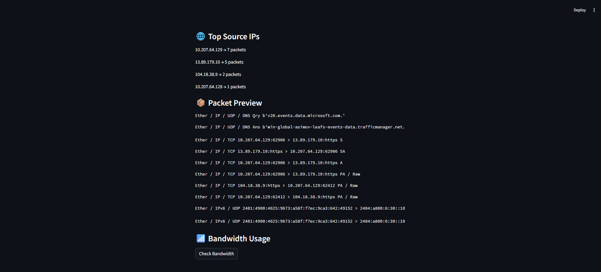

# 🚦 Traffic Analyzer

A Python-based network traffic analyzer that captures and analyzes network packets in real time, with an interactive web interface built using Streamlit.

---

## 📌 Overview

This project is designed to monitor and analyze network traffic efficiently. It uses packet sniffing techniques to capture live data and presents meaningful insights through a simple and user-friendly dashboard.

---

## ✨ Features

* 📡 Real-time packet capture
* 🔍 Protocol, IP, and port analysis
* 📊 Interactive UI with Streamlit
* ⚡ Lightweight and modular design
* 🧩 Easily extendable architecture

---

## 🛠️ Tech Stack

* Python 3.x
* Streamlit
* Scapy
* psutil

---

## 📁 Project Structure

```
traffic-analyzer/
│
├── app.py          # Streamlit UI
├── sniffer.py      # Packet capturing logic
├── analyzer.py     # Packet analysis
├── utils.py        # Helper functions
├── requirements.txt
├── README.md
└── .gitignore
```

---

## ⚙️ Installation

### 1. Clone the repository

```
git clone https://github.com/your-username/traffic-analyzer.git
cd traffic-analyzer
```

### 2. Create a virtual environment

```
python -m venv venv
```

Activate it:

* Windows:

```
venv\Scripts\activate
```

* Mac/Linux:

```
source venv/bin/activate
```

---

### 3. Install dependencies

```
pip install -r requirements.txt
```

---

## ▶️ Usage

Run the application:

```
streamlit run app.py
```

Open in browser:

```
http://localhost:8501
```

---

## ⚠️ Important Note

Packet sniffing requires elevated privileges:

* Linux/Mac → Run with `sudo`
* Windows → Run terminal as Administrator

---

## 🧠 How It Works

* `sniffer.py` captures packets using Scapy
* `analyzer.py` processes packet data
* `utils.py` provides helper utilities
* `app.py` displays insights via Streamlit

---

## 📸 Preview


<p align = "center">
    
    
</p>


---

## 🚀 Future Improvements

* Packet filtering (IP, port, protocol)
* Export data (CSV/JSON)
* Real-time graphs
* Intrusion detection alerts
* Historical traffic logging

---

## 🤝 Contributing

Contributions are welcome!

1. Fork the repository
2. Create a new branch
3. Commit your changes
4. Push and create a Pull Request

---

## 📄 License

This project is licensed under the MIT License.

---

## 👨‍💻 Author

Your Name
GitHub: https://github.com/Soni-adi15
